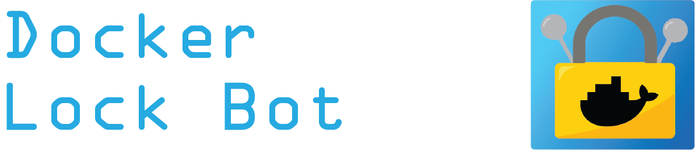

# About


A [GitHub App](https://docs.github.com/en/developers/apps/about-apps) that automates
[docker-lock](https://github.com/michaelperel/docker-lock),
a tool to manage docker image digests by tracking them in a
separate Lockfile (`docker-lock.json`).

When added to your repo, `docker-lock-bot` will make pull requests to update
the Lockfile whenever base images change.

# Demo
Let's assume we have added `docker-lock-bot` to a repo with a Dockerfile that
starts with the base image:
```
FROM ubuntu:latest
```

&nbsp;

`docker-lock-bot` will make a pull request with a Lockfile containing the
image digest for the `ubuntu:latest` base image.

&nbsp;

When we merge the pull request, we can see that the Lockfile (`docker-lock.json`)
is now in the default branch, `master`.

&nbsp;

The Lockfile contains the name, digest, and tag of the base image.

&nbsp;

Now, let's assume that the maintainers of the `ubuntu:latest` base image have pushed
a change. Even though we did not change our code, this will affect our application
and we should be aware of it.

`docker-lock-bot` will make another PR with a new digest.

&nbsp;

> Note: The previous digest ended in `636d` and the new digest ends in `145f`.

With `docker-lock-bot`, if a base image changes or you make a change to
Dockerfiles or docker-compose files, your Lockfile will always be up-to-date,
automatically.

If your application breaks because of a base image update, you will be aware and can always rollback to a working image by specifying the digest.

# Contributing
A development container has been provided, so ensure docker is installed and
the docker daemon is running.

* Open the project in [VSCode](https://code.visualstudio.com/).
* Install VSCode's [Remote Development Extension - Containers](https://marketplace.visualstudio.com/items?itemName=ms-vscode-remote.vscode-remote-extensionpack).
* In the command palette (ctrl+shift+p on Windows/Linux, command+shift+p on Mac),
type "Reopen in Container".
* Install dependencies: `npm install`
* Run the dev instance: `npm run dev`
* Navigate to `localhost:3000` and follow instructions to add the app to your repo